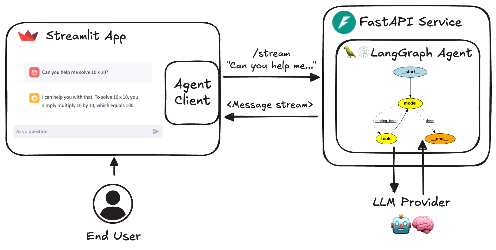

# Agentic Orixa

An AI agent service built with LangGraph, FastAPI and Streamlit.

## System Architecture

For detailed architecture documentation, see [System Architecture](docs/system_architecture.md)

### Core Components
1. **Service Layer** (FastAPI)
   - REST API endpoints
   - Real-time streaming
   - Authentication and rate limiting
   - LangSmith integration

2. **Agent Layer**
   - Multiple agent types
   - Tool integration
   - State management
   - Conversation history

3. **Configuration Management**
   - Environment variables
   - Multiple LLM providers
   - Type-safe settings

4. **Data Structures**
   - Protocol schema definitions
   - Type-safe models
   - Validation patterns

## Implementation Details

### Agent Implementation
For detailed agent documentation, see [Agent Implementation](docs/agent_implementation.md)

- Centralized agent registry
- Tool integration patterns
- State management
- Testing and debugging

### Service Implementation
For detailed service documentation, see [Service Implementation](docs/service_implementation.md)

- API endpoint design
- Authentication patterns
- Deployment strategies
- Performance optimization

## Quickstart

Run directly in python

```sh
# At least one LLM API key is required
echo 'OPENAI_API_KEY=your_openai_api_key' >> .env

# uv is recommended but "pip install ." also works
pip install uv
uv sync --frozen
# "uv sync" creates .venv automatically
source .venv/bin/activate
python src/run_service.py

# In another shell
source .venv/bin/activate
streamlit run src/streamlit_app.py
```

Run with docker

```sh
echo 'OPENAI_API_KEY=your_openai_api_key' >> .env
docker compose watch
```

## Architecture Diagram



## Key Features

1. **LangGraph Agent**: Customizable agent framework
2. **FastAPI Service**: Robust API implementation
3. **Advanced Streaming**: Token and message streaming
4. **Streamlit Interface**: User-friendly chat UI
5. **Multiple Agent Support**: Flexible agent management
6. **Asynchronous Design**: Efficient request handling
7. **Feedback Mechanism**: LangSmith integration
8. **Dynamic Metadata**: Service configuration discovery
9.  **Docker Support**: Easy development and deployment
10. **Testing**: Comprehensive test coverage

## Setup and Usage

1. Clone the repository:

   ```sh
   git clone https://github.com/JoshuaC215/agent-service-toolkit.git
   cd agent-service-toolkit
   ```

2. Set up environment variables:
   Create a `.env` file in the root directory. At least one LLM API key or configuration is required. See the [`.env.example` file](./.env.example) for a full list of available environment variables.

### Docker Setup

1. Build and launch the services in watch mode:

   ```sh
   docker compose watch
   ```

2. Access the Streamlit app at `http://localhost:8501`
3. Access the API docs at `http://localhost:8080/redoc`

### Local Development

1. Create virtual environment:

   ```sh
   pip install uv
   uv sync --frozen
   source .venv/bin/activate
   ```

2. Run services:

   ```sh
   python src/run_service.py
   streamlit run src/streamlit_app.py
   ```

## Customization

To customize the agent:

1. Add new agents to `src/agents`
2. Register agents in `src/agents/agents.py`
3. Adjust Streamlit interface in `src/streamlit_app.py`

## Documentation

- [System Architecture](docs/system_architecture.md)
- [Agent Implementation](docs/agent_implementation.md)
- [Service Implementation](docs/service_implementation.md)
