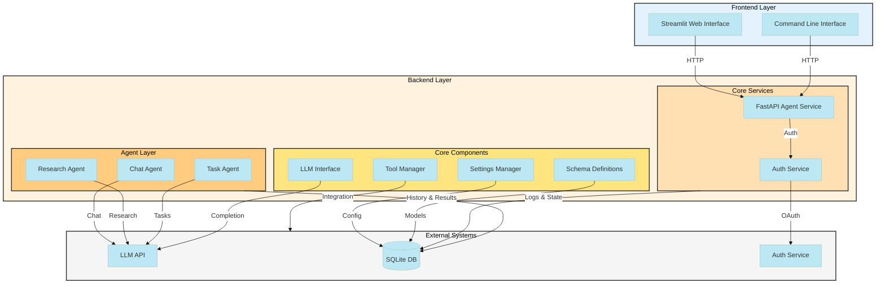
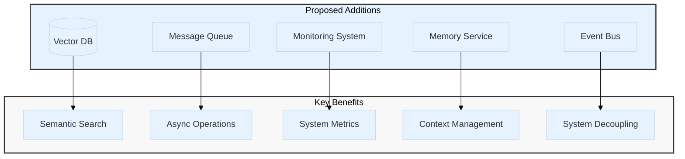

# System Architecture

## Current Implementation

## Current Components

### External Systems

- **LLM API**: Multiple LLM providers (OpenAI, Anthropic, Google, etc.)
- **SQLite DB**: Local state persistence and checkpointing
- **Auth Service**: Basic bearer token authentication

### Frontend Layer

- **Web Interface (Streamlit)**: Primary user interface
- **Command Line Interface**: Development and testing interface

### Backend Layer

#### Core Services

- **Agent Service (FastAPI)**: Main API gateway and request router
- **Auth Service**: Basic authentication and authorization

#### Agent Layer

- **Chat Agent**: Basic conversational agent
- **Research Agent**: Web search and calculator capabilities
- **Task Agent**: Background task execution

#### Core Components

- **LLM Interface**: Multi-provider LLM abstraction
- **Settings Manager**: Environment-based configuration
- **Schema Definitions**: Pydantic data models
- **Tool Manager**: Basic tool integration system

## Suggested Enhancements

### Proposed Enhancements

1. **Vector Database**
   - Semantic search capabilities
   - Conversation memory embeddings
   - Document storage and retrieval
   - Suggested implementations: Chroma, Weaviate, or Pinecone

2. **Message Queue**
   - Asynchronous task processing
   - Better scalability
   - Reliable message delivery
   - Suggested implementations: Redis, RabbitMQ, or Apache Kafka

3. **Monitoring System**
   - System metrics collection
   - Performance monitoring
   - Error tracking
   - Suggested implementations: Prometheus + Grafana

4. **Memory Service**
   - Advanced context management
   - Long-term conversation storage
   - Memory retrieval strategies
   - Integration with Vector DB

5. **Event Bus**
   - Decoupled component communication
   - Event sourcing
   - System extensibility
   - Suggested implementations: Redis Pub/Sub, Apache Kafka

## Implementation Priorities

1. **Phase 1: Memory Enhancement**
   - Implement Vector DB
   - Create Memory Service
   - Enhance context management

2. **Phase 2: Scalability**
   - Add Message Queue
   - Implement Event Bus
   - Enhance async operations

3. **Phase 3: Observability**
   - Add Monitoring System
   - Implement metrics collection
   - Set up dashboards

## Current Data Flows

1. User interactions flow through frontend interfaces to Agent Service
2. Agent Service handles authentication and routing
3. Agents utilize LLM API for processing
4. Tools provide external integrations
5. SQLite DB stores state and history
6. Authentication flows through Auth Service

## Future Data Flows

1. Vector DB will handle semantic search and embeddings
2. Message Queue will manage async operations
3. Event Bus will handle internal communication
4. Monitoring will collect system-wide metrics
5. Memory Service will manage advanced context